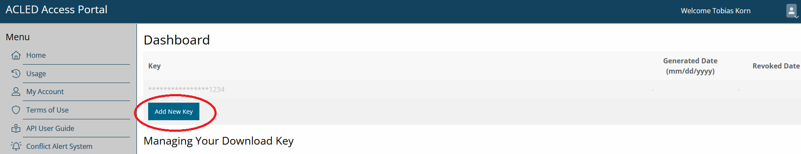

# Overview

This tutorial provides an example for a complete empirical conflict study, presented for the use case of Madagascar. We assume that users are already somewhat familiar with using *R* and handling geodata. If you are new to either of them or want a quick refresher, check out our introductory tutorial here.  

This tutorial shows how to download publicly available conflict event data, and merge them with additional data supplied by the *mapme.biodiversity* package. In the end, we want to provide a couple of informative figures, and conduct an empirical analysis for Madagascar that investigates the correlation between civil conflict and forest fires, which we measure via $CO_2$ emissions. 

Our tutorial will go through the following steps: 

  1. [**Data Collection**](#headline1): This first part discusses the download of the dataset and how to arrange the workspace. This will include downloading ACLED conflict data, arranging a grid dataset that covers our study region Madagascar, and downloading additional data via *mapme.biodiversity*. For more detailed information for first-time *R* users, see our tutorial here. 
  
  2. [**Dataset Preparation**](#headline2): The second section shows how to prepare our dataset. We will merge our conflict data with the spatial grid, and prepare the necessary variables for the further analysis. 
  
  3. [**Illustrating the Dataset**](#headline3): In section 3, we prepare a couple of figures and descriptive statistics. Starting our analysis this way helps getting familiar with the dataset and help making the right decisions for the empirical analysis. 
  
  4. [**Empirical Analysis**](#headline4): Our final section is devoted to conducting an empirical analysis. We will look at correlations between conflict and $CO_2$ emissions from forest fires, test different estimators, and quickly discuss how to interpret our results and what we have to keep in mind when thinking about their causal implications.   

# <a name="headline1"></a> Data Collection
  
We will create the dataset for our analysis from three building blocks: 

  1. **ACLED Conflict Data**: We will download them by hand and prepare them afterwards in [part 2](#headline2). 
  2. **A Spatial Grid**: A collection of regular rectangles that covers Madagascar and constitutes our unit of observation. 
  3. **Additional spatial indicators**: $CO_2$ emissions and additional variables that we download via *mapme.biodiversity*.

## Setting up your session

Before we start, we need to prepare our session. You should already have set up a folder on your computer where we will be storing our files. Let's start our *R Project* by initiating a new project. If you are using *RStudio*, click on `File->New Project` to get started. Save the project in the same folder in which you want to store the data we'll download here.

We can now open our script and get the session started by loading the libraries we need. Don't forget to install packages you did not install yet with the `install.packages()` command. Then we load the required packages: 

```{r, eval=T, echo=T, results='markup',message=F,warning=FALSE,fig.width=12, fig.height=7}
# Load libraries: 
library(tidyverse) # For data wrangling
library(sf) # For handling spatial data
library(mapme.biodiversity) # To download additional indicators
library(exactextractr) # Used by mapme to extract raster data
library(landscapemetrics) # Used by mapme to extract raster data
library(rstac) # Used by mapme to handle raster data
library(geodata) # Helps download spatial data
library(fixest) # For regressions
library(modelsummary) # To present our empirical results in a nice table
library(acled.api) # To download ACLED data
library(tmap) # For plotting maps

# Create a folder to store our downloads: 
dir.create("raw_data")
```

We are now set to download our data and fill the *raw_data* folder we just created with life. Let's start by downloading the **ACLED Conflict Data**.

## Downloading ACLED Conflict Data

The *"Armed Conflict Location & Event Dataset (ACLED)"* is one of the two mainly used conflict datasets. The other one would be the *Uppsala Conflict Data Program (UCDP)*, which is already available as an indicator in the *mapme.biodiversity* package. There are certain pros and cons to each of these two databases, and you will have to decide which one you need based on the question you want to investigate. For the case of Madagascar, ACLED provides the more useful conflict database.

&nbsp; &nbsp;


<details>

 <summary>Why ACLED instead of UCDP?</summary>
  
For our Madagascar case study, we choose ACLED over UCDP. The choice between these two datasets strongly depends on your research question. UCDP has the advantage that it tracks ongoing civil conflicts, i.e. it defines actors like governments or rebel groups that are part of ongoing conflicts, and link each battle event to the actors of a conflict. However, they do so only for ongoing conflicts that involve repeated clashes between at least two defined actors in a country that demand at least 25 battle-related deaths within a year. ACLED does not follow such a clear structure of conflicts, but instead includes all kinds of smaller clashes and riots. While it does not allow us to follow actors or focus on civil conflicts, it provides information on many more events. For our case of Madagascar, ACLED is the better choice. While UCDP does not register many events of ongoing conflicts because most of the violence in Madagascar does not qualify for UCDP's defined thresholds, ACLED includes numerous low-intensity conflict events like riots, cattle rustling, or road banditry. 

For other case studies where you are interested in ongoing conflicts, UCDP may be the better option to use. They devote a lot of effort into associating battles with defined actors and ongoing conflicts, so you'll find it easier to trace the developments and consequences of specific conflicts. You find an example for how to download and prepare UCDP data for the case of Iraq here. 
</details>


&nbsp; &nbsp;

To download conflict data from ACLED, you need to register at the ACLED homepage and create an *API key*. Once you have your *API key* ready, we are good to go and download the data we need. 

&nbsp; &nbsp;

<details>

 <summary>How to create a free ACLED API key</summary>

Downloading ACLED data requires setting up a free account to get an API key for data access via their [project webpage](#https://acleddata.com/register/). 


Click on the "ACLED Access Portal" button on the homepage, select "Register", and insert the information you want to use for your user account.  


After completing the registration, ACLED will send you an E-Mail to verify your mail address and activate your account. Click on the verification link in the E-Mail. The link will directly send you to the ACLED dashboard, where you need to consent to ACLED's Terms of Use: 


Next, click the "Add New Key" Button to receive an API key to download ACLED data for your project. Make sure to copy the key after creating it, we will need it below. 



</details>

&nbsp; &nbsp;


One option would be to download the data directly via the dashboard on ACLED's homepage. And even smarter way is to conduct the download directly from your R Session. This has two advantages: 

  1. You can easily adjust the code to other case studies with no need to specify everything anew. 
  2. Each time you re-run your code, your ACLED dataset will automatically be updated. This is useful if ACLED ex post corrects errors in their database. 

However, make sure to save the data you downloaded via the API on your local disk so you can continue working with the downloaded data later on. Downloading the dataset takes time, and requires a stable internet connection. Similarly, depending on the licence ACLED grants you, you might be restricted in the number of downloads you can do per year. 

To download ACLED data directly via *R*, we will use the `acled.api()` function from the package of the same name. The function is quite easy to use. We just need to supply the mail address that we used to register with ACLED, and the API key we generated on their homepage. We can then define for which country or countries we want to collect data, and set the start- and end-date for which we want to download the data. Note that instead of supplying the `country=` argument, you can also specify a full ACLED region, e.g., `region="Africa"`. You can, of course, also specify neither `country=` nor `region=`. The function will then download the data for all countries included in the ACLED data base.

Let's narrow down our download to Madagascar and the year 2017. Make sure to specify `all.variables = T`. Otherwise, the function will only download a selection of variables where some important ones, e.g. the coordinates where an event took place, are missing:
 

```{r, eval=F, echo=T, results='markup',message=F,warning=FALSE,fig.width=12, fig.height=7}
acl <- acled.api(email.address = "YOUR-EMAIL@ADDRESS",
          access.key = "YOUR-API-KEY",
          country="Madagascar",
          start.date = "2017-01-01",
          end.date = "2017-12-31",
          all.variables = T)
```

You'll see that we now have a new element called `acl` in our environment. This is already the conflict dataset we want!

Downloading the data takes a bit of time, and obviously is only possible with a (rather stable) internet connection. We therefore recommend that you save your download in the *raw_data* folder and read it again so that you don't have to download the data anew each time you run your script. Make sure to run the download command once in a while though to not miss out on updates from ACLED. 

```{r, eval=F, echo=T, results='markup',message=F,warning=FALSE,fig.width=12, fig.height=7}
# Save dataset
write_rds(acl, "raw_data/ACLED_Madagascar.R")
```

```{r, eval=T, echo=T, results='markup',message=F,warning=FALSE,fig.width=12, fig.height=7}
# And load it for further processing:
acl <- read_rds("raw_data/ACLED_Madagascar.R")

# Let's have a look at the data: 
head(acl[,1:25])
```

That's already it for downloading our conflict data. We'll now have to prepare our spatial grid dataset and collect our other indicators via *mapme.biodiversity* before continuing with the preparation of the ACLED conflict data.

## Create Spatial Grid Dataset

The basic building block for our Madagascar study will be a spatial grid. To get there, we will: 

  1. Download a shapefile with the country boundaries for Madagascar. 
  2. Construct a grid of the same extent and geographic area as the Madagascar shapefile. 
  3. Cut out the actual borders of Madagascar to fit the cells inside the borders. 
  
&nbsp; &nbsp;
  
<details>

 <summary>More on Grid datasets</summary>

Grids are commonly used formats for a spatial analysis. The idea behind using grid cells as the level of observation is to get independent of other commonly used spatial entities like administrative boundaries. 

You might know grids from raster data, the second main type of spatial data other than vector data. Grids are similar to raster data, as they also consist of a number of equally sized cells that span the whole area of interest. There are however a number of important differences: 

  1. Grids are still vector data and we can handle them with the *sf* package. 
  2. This also makes it easier to interact grids with other vector data like points or polygons. 
  3. While raster data are always made up of quadratic pixels, we can vary the shape of grid cells. Recently, hexagonal grid cells have come into fashion in some scientific fields. 
  4. Grid cells can hold various indicators at the same time, and we can combine them to multivariate datasets. This is a bit more complicated with raster data. 
  
Grids have the advantage over administrative boundaries that they are "exogenous", i.e. they do not depend on political or economic conditions on the ground that shaped the way administrative borders look like. In addition, it is easy to vary the size of grid cells and conduct your analysis for different cell sizes. However, if you care about political outcomes or want to use data that are collected for political spatial units (e.g. county-level income inequality), political areas are of course the better choice for your dataset.

Optimally, you repeat your analysis at different spatial resolutions to address the *Modifiable Areal Unit Problem (MAUP)*. The MAUP states the concern that, if you're unlucky, your results might depend on the spatial resolution you use for your analysis. Varying the spatial unit of analysis is pretty easy with grid cells because you can just adjust the cell size and check whether your results are robust across different grid cell resolutions.    
  
</details>

&nbsp; &nbsp;


To get our grid started, let's download a country shapefile for Madagascar using the `geodata` package. Note that, since we will construct a grid dataset, it is enough to get Madagascar's national borders via `level=0`. Via `path="raw_data"`, we can directly save the shapefile in our raw data folder: 

```{r, eval=T, echo=T, results='markup',message=F,warning=FALSE,fig.width=9, fig.height=4}
## Use the gadm() function from the geodata to get a country shapefile: 
mdg_sf <- gadm(country="madagascar",level=0,path="raw_data")
mdg_sf <- st_as_sf(mdg_sf) # Convert to sf
```

Let's see what the `gadm()` function got for us: 

```{r, eval=T, echo=T, results='markup',message=F,warning=FALSE,fig.width=9, fig.height=4}
plot(st_geometry(mdg_sf)) # Only plot the geometry with st_geometry()
```

If we have a polygon on which to base our grid, making the grid dataset is fairly easy. We only need to supply our polygon dataset with the national border of Madagascar to the `st_make_grid()` function and specify the cell size we want. Note however that we should transform our polygon first into an equal-area *Mollweide* projection. We'll use a cell size of 50km for the start, which gives us cells with an area of $50 \times 50 = 2500km^2$. Since the *Mollweide* projection measures everything in meters, we must specify `cellsize=500000` for that. With `square=T` (the default), we create quadratic cells. Setting it to `FALSE` would give you hexagonal cells (try it!). 

&nbsp; &nbsp;

<details>

 <summary>Why the Mollweide transformation?</summary>

Our country border polygon comes by default in the Mercator (WGS84) reference system when we use the `gadm()` function. This means that all points that make up the polygon are measured in degrees longitude and latitude. This is often the easiest way to go, but might get a bit tricky with grid datasets for two reasons: 

  1. The Mercator reference system assures that all directions and locations are correctly mapped from our 3D-world to a 2D representation. To do so, it has to sacrifice having the areas correct. When working with grid cells, we want all cells to have the same area, but the Mercator projection would force them to become smaller and smaller the farther we move away from the equator. For Madagascar, this would not be that problematic, but for global samples or bigger countries that might get us into a mess. 
  2. We'll have to define the size of our grid cells when we create the grid. When thinking about grid cells as our unit of observation, it is much more intuitive to think about (square) kilometers etc. than "square degrees." The *Mollweide* projection measures everything in meters and hence makes defining and thinking about cell sizes much easier.  

Note however that *Mollweide* is a global projection. It therefore gets areas quite well, but definitely not perfect. If you work in a very local setting, like here for Madagascar, a local projection is an even better choice. Most countries have a national projection (Google will help you find the right ones). If you want to limit your analysis to e.g. Madagascar, you could use the Madagascar-specific Laborde projection with the EPSG code 29701. 


</details>

&nbsp; &nbsp;


```{r, eval=T, echo=T, results='markup',message=F,warning=FALSE,fig.width=9, fig.height=4}
# Transform to Mollweide Equal-Area Projection:
mdg_sf <- st_transform(mdg_sf,crs="+proj=moll")
# Construct Grid:
mdg_grid <- st_as_sf(st_make_grid(x=mdg_sf,
                         cellsize = 50000,
                         square=T))
```

Let's see what our grid dataset looks like by plotting it with the `tmap` package: 

```{r, eval=T, echo=T, results='markup',message=F,warning=FALSE,fig.width=9, fig.height=4}
tm_shape(mdg_grid) + 
  tm_borders() + 
  tm_shape(mdg_sf) + 
  tm_borders()
```

&nbsp; &nbsp;


<details>

 <summary>Basics on `tmap`</summary>

The `tmap` syntax is very similar to the syntax we know from *ggplot()*, yet it is customized for making maps. Like in *ggplot()*, you need to specify the plot parameters first by supplying an *sf* object to the `tm_shape()` function. We then add additional commands with a `+`. As in *ggplot()*, you then specify *what* you want to plot, e.g. the borders (`tm_borders()`), the full polygons (`tm_polygons()`), or colors/fillings based on a variable (`tm_fill()`)  The nice thing in `tmap` is that we can overlay different maps by just specifying a new `tm_shape()` over and over again. 

</details>

&nbsp; &nbsp;


You probably noticed that we are not quite there yet. We have our grid, but it spans the whole extend of our Madagascar plot and goes way beyond the country's borders. That's not exactly what we want yet. 

To get rid of all the grid cells that fall outside Madagascar's borders, we'll want to *intersect* our grid to Madagascar's borders: 

```{r, eval=T, echo=T, results='markup',message=F,warning=FALSE,fig.width=9, fig.height=4}
mdg_grid <- st_intersection(mdg_grid,mdg_sf)
```

Looking better now?

```{r, eval=T, echo=T, results='markup',message=F,warning=FALSE,fig.width=9, fig.height=4}
tm_shape(mdg_grid) + 
  tm_borders() + 
  tm_shape(mdg_sf) + 
  tm_borders()
```

That's now the grid we want! Note however that not all cells fit perfectly into the borders. Many of those right at the borders were cut into smaller pieces. In our later empirical analysis, it will be important to account for that difference. Obviously, cells of much smaller area will have a much smaller likelihood to host conflict events and so on. 

## Download additional indicators via *mapme.biodiversity*

We now have a grid dataset as our basic building block ready, and conflict data downloaded that are waiting to be merged. The only thing we still need to add are additional indicators for our empirical analysis. We will use the *mapme.biodiversity* package to get a number of additional indicators nicely tailored to our grid dataset. 

Our goal is to download a whole bunch of additional data. To not overcrowd our folder, we can specify the subfolder where we want to store these data. Let's specify the `raw_data` folder we created in the beginning. If you keep working with the *mapme.biodiversity* package for different projects, you might want to set a global folder for the *mapme.biodiversity* data. The advantage is that before downloading data, the *mapme.biodiversity* package checks whether these data are already contained in the output folder you specify. If so, it will not download them again, so you save a lot of time (and disc space).

The function `mapme_options()` allows us to change the download folder. We also can (and might want to) adjust some of the download options. Inside `mapme_options()`, we can specify the `retries=` option to increase the number of attempts the function takes to download a resource. Downloads might fail due to connection issues, so giving it a higher number of attempts helps the code not fail. In addition, we can increase the `timeout=` value, measured in in seconds, within the `options()` function. This specifies how long *mapme.biodiversity* will maximally spend to download a dataset. Big datasets take time, so the default of 1000 seconds might not be enough. 

```{r, eval=F, echo=T, results='markup',message=F,warning=FALSE,fig.width=12, fig.height=7}
## Set output folder: 
mapme_options(outdir = "raw_data",retries=10)
options(timeout = 5000)
```

As we describe in more detail in another place, the *mapme.biodiversity* package follows a strictly defined workflow: 


```{r, eval=T, echo=F, results='markup',message=F,warning=FALSE,fig.width=9, fig.height=6}
library(ggflowchart)

fl <- data.frame(
  from = c("Define Spatial Polygons","Set Download Options","Check Resources","Download Resources","Calculate Indicators"),
  to = c("Set Download Options","Check Resources","Download Resources","Calculate Indicators","Start Analysis")
)
#fl
node_types <- data.frame(
  name=c("Define Spatial Polygons","Set Download Options","Check Resources","Download Resources","Calculate Indicators","Start Analysis"),
  type = c("T1","T1","T2","T2","T2","T3")
)
f <- ggflowchart(fl,node_types,fill=type,text_size = 8) + 
  theme(legend.position="none")
f
```

We already have our Spatial Polygons ready: our grid dataset. The next step will be to check which resources are available and how to download each of them, and then download the resources we want to use. Finally, we can calculate the indicators we need from these resources, and then proceed to preparing our dataset for the analysis. 

Let's start and check what resources we want to download. The *mapme.biodiversity* package provides a nice overview of all available resources with the `available_resources()` function. Because *R* by default will only show you the first 10 results but there are many more resources, we need to wrap the function with the `print()` function: 

```{r, eval=T, echo=T, results='markup',message=F,warning=FALSE,fig.width=12, fig.height=7}
## Check available resources:
print(available_resources(),n=30)
```

The table that gets returned shows us what data we can download with the *mapme.biodiversity* package. For each of these resources, we will have to $(i)$ define the function to download them, and $(ii)$ specify what we want to download from these resources. The function to download is simply `get_` plus the resource name. So for example, we will have to supply `get_gfw_emissions()` to download data on CO2 emissions from forest fires. The specifities of what we want to download depends on the type of resource. Usually, we can define the version of the dataset and/or the time frame if the resource is a panel dataset. 

Don't worry, the *mapme.biodiversity* package provides you with an overview of what to download how for each resource. So, to find out how to download for example a dataset on local population size, we can call the resource-specific help file with `?`:

```{r, eval=F, echo=T, results='markup',message=F,warning=FALSE,fig.width=12, fig.height=7}
?worldpop
```

This helpfile gives us a quick overview of the source data. It tells us that the `worldpop` resource contains local population counts at 1km spatial resolution for the years 2000 until 2020. It also tells us that we need to use the `get_worldpop()` function to download this resource, and that inside this function, we have to specify for which year we want to download the data with the `years=` argument. 

We can do the same for all other resources that we are interested in. For our case study, let's look into the correlation between ACLED conflict events and CO$_2$ emissions from forest fires. For additional control variables, we can further download data on *treecover*, *travel time* to the next city, and *population*.

To get all these data, we supply the respective functions to the `get_resources()` function. This `get_resources()` function further requires the spatial polygon dataset for which we want to collect the data. This is the `mdg_grid` object that we created above. 

```{r, eval=F, echo=T, results='markup',message=F,warning=FALSE,fig.width=12, fig.height=7}
## Select Resources:  
sources <- get_resources(x=mdg_grid, # our spatial polygon dataset
                         get_worldpop(years = 2015), # downloading worldpop data
                         get_gfw_lossyear(version = "GFC-2023-v1.11"), # yearly forest loss data
                         get_gfw_emissions(), # downloading CO2 emissions data
                         get_nelson_et_al(ranges = "20k_50k"), # distance to next city
                         get_gfw_treecover() # downloading tree coverage data
                         )
```

The data will be downloaded to the direction we specified above in the `mapme_options()` function. If you followed our code above, you will find several new folders and files in your "raw_data" folder. 

Our next step will be to use these datasets and let *mapme.biodiversity* calculate the indicators we want to work with: CO$_2$ emissions from forest fires, tree coverage, and population. For this, we need to know which functions to supply. We will use the `calc_indicators()` function of *mapme.biodiversity* to construct the variables we need from the raw data we just downloaded. Inside this `calc_indicators()` function, we must specify one function per resource to download. We get these functions from the `available_indicators()` function: 


```{r, eval=T, echo=T, results='markup',message=F,warning=FALSE,fig.width=12, fig.height=7}
## Check functions to calculate indicators: 
print(available_indicators(),n=30)
```

For each indicator we want, the function we need is a combination of the prefix `calc_` and the name of the indicator. For most indicators, we can specify additional calculation options, e.g. for which years we want to create the variables. To find out what we can specify within each `calculation` function, open the indicator's helpfile with, e.g., `?treecover_area`. 

Let's prepare our indicators:

```{r, eval=F, echo=T, results='markup',message=F,warning=FALSE,fig.width=12, fig.height=7}
## Calculate Indicators for same years (roughly) as our conflict indicator:
our_data <- calc_indicators(x=sources, # x is the name of our resource package defined above
                            calc_treecoverloss_emissions(years=2000:2017), # CO2 Emissions
                            # calc_drought_indicator(), # Drought Indicator
                            calc_traveltime(engine = "exactextract",stat="min"), # downloading distance to next city
                            calc_population_count(), # Population
                            calc_treecover_area(years=2017) # Treecover
                            )
```


```{r, eval=T, echo=F, results='markup',message=F,warning=FALSE,fig.width=12, fig.height=7}
## Calculate Indicators
our_data <- read_rds("raw_data/mapme_indicators.R")
```

# <a name="headline2"></a> Dataset Preparation

All the data we need for our analysis were now downloaded. You can check yourself in your working directory: there should now be, in addition to the ACLED data we downloaded ourselves, a number of folders containing the data sources *mapme.biodiversity* downloaded for us. In addition, *mapme.biodiversity* prepared all the indicators we asked for from these data and stored them in the object `our_data`. It is now time to combine all these indicators into *one dataset*. 

Currently, we have two datasets that we are looking to combine: 

  1. The data frame `acl`, which contains the conflict information from ACLED. 
  2. The simple feature `our_data` which already combines our grid with the indicators we downloaded via *mapme.biodiversity*.

## Prepare *mapme.biodiversity* Output

Before we can combine these two data sources, we first need to complete the preparation of the `our_data` object. If you have a closer look at it, e.g. via `View(our_data)` or just by clicking on it in your environment-window in the top-right of your RStudio window, you will notice that it does not yet look the way we want it to. 

The output from *mapme.biodiversity* stores all the variables from each indicator as a list inside the dataframe. This is, currently we have one column per indicator, e.g. "active_fire_counts", which is not really a variable but rather a collection of variables. We'll now go indicator by indicator, extracting the variables *mapme.biodiversity* stored there for us. 

One **important note** before we go on: Below, we will prepare each indicator one-by-one after extracting them with the `unnest()` function. We will do so because we decided above to get the indicators for different time windows, so we'll need to apply different processing steps to each of them. The reason we do this is to dive deeper into the different ways to process spatio-temporal indicators in this tutorial. A much easier way would be to first download all indicators for exactly the same time window, and then use the function `portfolio_long()` to get them into a "long" panel format. This panel format has one observation (for each indicator) for each location and time. We will achieve the same panel format below. Alternatively, you could also use the `portfolio_wide()` function to get a "wide" format. This format gives you one observation per location, but one variable for each indicator and time. For example, it would return you, for each grid cell, a variable for tree coverage in 2011, another variable for tree coverage in 2012, and so on. The final choice depends on what you want to do with the data. For panel regressions, the long format is definitely the way to go. If you are mainly interested in producing maps and graphically comparing indicators over time, the wide format is probably the better choice. 

Now back to data processing. If we have data for different time windows and want to avoid the `portfolio_long()` and `portfolio_wide()` functions, we need to extract each indicator from our portfolio, currently stored as lists, with the `unnest()` function from the *tidyverse*. This function does exactly what we need - it converts a list-column into an actual data frame: 

```{r, eval=T, echo=T, results='markup',message=F,warning=FALSE,fig.width=12, fig.height=7}
# We only need to supply the name of our dataset ("our_data") and each time the name of the indicator we want to extract:
co2 <- unnest(our_data,treecoverloss_emissions)
trees <- unnest(our_data,treecover_area)
pop <- unnest(our_data,population_count)
trav <- unnest(our_data,traveltime)
```

It's always a good idea to check the dimensions of your newly created data frames. You easily see this in the environment-window in the top-right of RStudio. To check it automatically, we can use the `lapply()` function on a list with our four datasets to quickly get an overview:

```{r, eval=T, echo=T, results='markup',message=F,warning=FALSE,fig.width=12, fig.height=7}
# Check dimension for each of the data frames:
lapply(list(co2,trees,pop,trav),dim) # The element dim refers to the function dim()
```

As you see, there is some difference across datasets. In fact, we have different numbers in the first dimension! This means that we have a different number of observations across the different indicators. For the second, third and fourth indicator (treecover, population and travel time), that difference is not so huge. The treecover indicator was not available for three of our 296 grid cells, so we only have 293 observations for this one indicator. That is nothing to worry about. 

However, we have many more observations for our $CO_2$ indicator - more than 5,000! This is because we downloaded this indicator for 18 years (2000 until 2017), so we have eighteen times the number of observations.  

To fit the $CO_2$ indicator into our cross section, we must aggregate the yearly data to one observation per grid cell. For some variables like (extreme) weather data, this aggregation process might be a bit difficult because the best way of aggregation depends on what you want to achieve.

&nbsp; &nbsp;


<details>

  <summary>Why is that?</summary>


  For example, do you care about the average drought risk in a region? Or do you care about the maximum risk? Both address different research questions. The former might be the better one if you want to compare locations' average drought exposure, while the ladder is much more suited to analyzing the effect of actual drought shocks on a location. Maybe, you might also be interested in a somewhat more complicated aggregation, e.g. the number of days per grid cell where the drought indicator was significantly high, e.g. two standard deviations above the mean.

</details>

&nbsp; &nbsp;

For our $CO_2$ indicator here, we will go with the two "simple" types of aggregation and get the average and sum of $CO_2$ emissions per location. We will also directly drop the geometry column from that data frame. We don't really need it as we will merge it later with our grid dataset. Yet, geometries increase the computation time of data aggregations significantly:

```{r, eval=T, echo=T, results='markup',message=F,warning=FALSE,fig.width=12, fig.height=7}
co2 <- co2 %>%
  st_set_geometry(NULL) %>% # drop geometry
  group_by(assetid) %>% # group by grid cell
  summarize(co2_mean = mean(value, na.rm=T), # Aggregate indicators
            co2_sum = sum(value, na.rm=T)) # Note that the indicator is saved under "value"
```

We are now ready to combine the four datasets *mapme.biodiversity* downloaded for us into one. To do so, you can pick anyone of the data frames as the base and merge the rest via the assetid variable. We will here start with the population indicator, and then, one-by-one, select the indicator we want from each data frame and merge it with our base. 

*mapme.biodiversity* stores the data output under the column name "value". So for each unnested data frame, we'll have to select the `assetid` (to merge everything later), and the column `value`, which we can directly rename to display the indicator. There are also other variables that tell us about the output, e.g. `variable` (the indicator name) or `unit` (the unit of measurement). If you downloaded your indicator for several years, you'll find the `datetime` variable helpful to sort the time-varying observations in your panel.

Don't forget to drop the geometry from all later data frames that you do not use as the base! We only need one geometry column, adding another (identical) one will confuse *R* and, in most cases, return an error:

```{r, eval=T, echo=T, results='markup',message=F,warning=FALSE,fig.width=12, fig.height=7}
# Start preparing your data frames: 
pop <- pop %>% 
  select(assetid,population = value) # we only need the assetid and our indicator

trees <- trees %>% 
  select(assetid,treecover = value) %>% # we only need the assetid and our indicator
  st_set_geometry(NULL) # Drop Geometry

trav <- trav %>% 
  select(assetid,traveltime=value) %>%  # we only need the assetid and our indicators
  st_set_geometry(NULL) # Drop Geometry

co2 <- co2 %>% # Note: We already dropped the geometry here before when aggregating
  select(assetid,co2_mean,co2_sum) # we only need the assetid and our indicators

# Now we can merge everything
df <- pop %>%   # Let's call our final dataset simply "df":
  left_join(trees, by = "assetid") %>% # merge trees by assetid
  left_join(co2, by = "assetid") %>%  # merge drought by assetid
  left_join(trav, by = "assetid")
```

## Add *ACLED* Data

The first part of our dataset is ready. It is now time to add our ACLED conflict indicators. This will require a little more spatial data manipulation. 

Let's have a look first. What we currently have are two simple features, i.e. datasets with a spatial component: 

  1. One of type Polygon that holds our grid cells and *mapme.biodiversity* data. 
  2. One of type Point that shows conflict locations. 
  
Our goal is to infer from the points data to information at the grid cell level. For example, we want to count the number of events or fatalities per grid cell. 

We first need to make our conflict dataset "spatially aware", i.e. tell R that this actually contains spatial information. Right now, we only have a usual data frame with columns that identify the longitude and latitude of an event. We can use these two columns to convert the data frame to a simple feature with the `st_as_sf()` function. In that function, we specify with `coords=` the two variables that identify longitude and latitude. We also assign it the WGS84 projection. Whenever you have spatial data that are longitude and latitude in degrees, they stem from the WGS84 projection. We assign the WGS84 projection with the EPSG-code "4326": 

```{r, eval=T, echo=T, results='markup',message=F,warning=FALSE,fig.width=12, fig.height=7}
acl_df <- st_as_sf(acl,
                   coords = c("longitude","latitude"),
                   crs = 4326)
```

Our ACLED data are now a simple feature! Our next step will now be to overlay these points with our grid cells. Before we do that, let's see graphically what we are about to do: 

```{r, eval=T, echo=T, results='markup',message=F,warning=FALSE,fig.width=12, fig.height=7}
tm_shape(df) + 
  tm_borders() + 
  tm_shape(acl_df) + 
  tm_sf(col="red")
```

You see how the red dots, each resembling one conflict event, are distributed across Madagascar? Our goal is now to: 

  1. Identify for each event into which grid cell it falls. 
  2. Collect the number of events and fatalities per grid cell. 
  
We will do this by first using `st_intersection()` as we did above to intersect the two datasets, i.e. find out which point intersects with which grid cell. Then, we will count the number of events and associated fatalities in each grid cell. 

Note that we will also filter our ACLED dataset before conducting the spatial merge based on its *geo_precision*. This variable tells us how certain the coders are that the coordinates attached to an event are correct. A value of "1" means that the coders know the exact town (close to) where an event happened and code this in the coordinates. A value of "2" refers to the rough region where an event took place, and "3" indicates events for which the location is very uncertain, i.e. when it is only known that an event took place in a forest, border area, etc. Let's restrict our dataset to those events with the highest precision. Luckily, these are the vast majority in our dataset: 

```{r, eval=T, echo=T, results='markup',message=F,warning=FALSE,fig.width=12, fig.height=7}
# Check distribution of precision codes:
table(acl_df$geo_precision)

# Filter precision codes, then conduct intersection: 
acl_df <- acl_df %>% 
    filter(geo_precision==1) %>% 
    st_transform(crs=st_crs(df)) %>%  # Transform to same CRS as our Grids
    st_intersection(df)
```

This intersection now attached our grids' assetid to the conflict dataset. I.e., we now know for each event in which of our grid cells it took place. We can now use this information to aggregate the conflict information at the grid cell level: 

```{r, eval=T, echo=T, results='markup',message=F,warning=FALSE,fig.width=12, fig.height=7}
acl_by_grid <- acl_df %>% 
  st_set_geometry(NULL) %>%  # We don't need the geometry anymore
  group_by(assetid) %>% 
  summarize(conflict_events = n(), # number of events per cell
            fatalities = sum(fatalities,na.rm=T)) # Fatalities per cell
```

Perfect, we can now merge the conflict data with our grid cell data. Note, importantly, that our aggregated conflict dataset only includes 134 observations vis-á-vis the 296 grid cells in our main data. The reason for that difference is simple: In many grid cells, no conflict took place in 2017. 

It is actually quite common for conflict data to include many zeros, i.e. a large number of locations where no conflict event gets recorded. Conflict data therefore almost always have a quite peculiar statistical distribution, which we will talk more about in the next section. For now, it is just important to *add these zeros*, i.e. to remember that we assign a zero in the conflict variables for each location without an event: 
```{r, eval=T, echo=T, results='markup',message=F,warning=FALSE,fig.width=12, fig.height=7}
df <- df %>% 
  left_join(acl_by_grid,by = "assetid") %>% 
  # Assign the zeros:
  mutate(conflict_events = ifelse(is.na(conflict_events),0,conflict_events),
         fatalities = ifelse(is.na(fatalities),0,fatalities))
```


That completes our dataset! We can now proceed to the visualization and analysis with our data.

# <a name="headline3"></a> Illustrating the Dataset

All good empirical analyses start with a good inspection and illustration of the data. This is the idea of this section. We will look into a couple of graphs and statistics that tell us more about the (joint) distributions of our key variables.

## Illustrating Conflict Data

Let's start with our conflict variables. We have two indicators here. One resembles the number of battles inside a grid cell during the year 2017. The other counts the fatalities associated with these battles. 

A good start with continuous variables is to look at the histogram. This nicely illustrates the full distribution of the variables: 

```{r, eval=T, echo=T, results='markup',message=F,warning=FALSE,fig.width=12, fig.height=7}
## For events:
ggplot(data=df,aes(x=conflict_events)) + geom_histogram(fill="steelblue")
## For fatalities:
ggplot(data=df,aes(x=fatalities)) + geom_histogram(fill="magenta")
```

Both variables, show a quite peculiar distribution: they are zero for many observations and take some very high values. Conflict variables more often than not look like this. The number or fatalities of battles are *count variables*, meaning that they are bounded to the left (there cannot be negative values). Such variables usually demand different statistical treatment, because the "common" statistical methods are tailored to normally distributed variables. Count variables are almost never normally distributed. 

A second problem in conflict variables is that they are highly dispersed, i.e. we have a lot of locations with no or maybe one event happening, and only a handful of locations with a high number of events and fatalities. Let's look a bit closer at the distribution: 

```{r, eval=T, echo=T, results='markup',message=F,warning=FALSE,fig.width=12, fig.height=7}
## The most important metrics: 
summary(df$conflict_events)
```

Here we nicely see the problematic distribution. By far the most locations saw no conflict at all in 2017. Even the third quartile is zero, i.e. at least 75% of the locations in Madagascar did not experience any event. However, there are some locations that experienced quite a lot: our maximum is 26!

There are a couple of possibilities to deal with such variables in regressions. One option is to categorize them, i.e. assign a categorical variable with values such as "no conflict", "some conflict", "a lot of conflict" or similar. If the dependent variable in our analysis has such a distribution, we can also use regression models that are tailored to count data, e.g. Poisson or Negative Binomial regressions. 

One simple (yet imperfect) trick is to take the logarithm of the variable. This has the advantage that the super high values move closer to the other observations, making the distribution less dispersed. Let's see whether this improves things. Don't forget to add +1 to your variables before taking logs. This is necessary because the logarithm of zero is not defined, so all zero observations would be lost from the dataset. Conveniently however, the log of one is just zero: 

```{r, eval=T, echo=T, results='markup',message=F,warning=FALSE,fig.width=12, fig.height=7}
df <- df %>% 
    mutate(ln_events = log(1+conflict_events),
           ln_dead = log(1+fatalities))
## Does the distribution look more normal? 
summary(df$ln_events)
```

The maximum now moved much closer to the many small values and zeros in our variable. We can have a look at the histogram to see whether overall things improved: 

```{r, eval=T, echo=T, results='markup',message=F,warning=FALSE,fig.width=12, fig.height=7}
## For events:
ggplot(data=df,aes(x=ln_events)) + geom_histogram(fill="steelblue")
## For fatalities:
ggplot(data=df,aes(x=ln_dead)) + geom_histogram(fill="magenta")
```

That still looks pretty dispersed. As you see, with such heavily skewed variables, also taking logs does not get us close to a normal distribution. Anyhow, we'll be able to work with that. Before we move on to the other variables, let's compute and look at categorical conflict variables that we can use for robustness tests later on:

```{r, eval=T, echo=T, results='markup',message=F,warning=FALSE,fig.width=12, fig.height=7}
## For events: 
df$events_ctg <- as.factor(cut(df$conflict_events,
                              breaks=c(-1,0,5,max(df$conflict_events))))

## For fatalities: 
df$dead_ctg <- as.factor(cut(df$fatalities,
                               breaks=c(-1,0,5,max(df$fatalities))))

## Let's illustrate the distribution of the fatality categories: 
ggplot(df, aes(x=dead_ctg)) + geom_bar(fill="firebrick")

```

Finally, another common solution to highly dispersed conflict data is ignoring the intensity and focusing only on conflict incidence. For this, we can create an indicator variable that simple tells us that at least one conflict event took place in a location in 2017: 

```{r, eval=T, echo=T, results='markup',message=F,warning=FALSE,fig.width=12, fig.height=7}
df$conflict_ind <- as.factor(ifelse(df$conflict_events>0,1,0))
```

## Illustrating other variables: 

Let's now turn to our other variables. Our main interest in the analysis below will be whether the occurrence of civil conflict is associated with an increase in forest fires. In our regressions we will therefore call our $CO_2$ forest fire indicator the *dependent variable*, i.e. the variable that we explain by others. 

Our conflict variable(s) will be our main *independent variables*, while our indicators for population and tree cover will be *control variables*. Now that we investigated the distribution of our independent variables, it is time to look into the *dependent variable*.

It's best to start as we did before - by looking at a histogram: 

```{r, eval=T, echo=T, results='markup',message=F,warning=FALSE,fig.width=12, fig.height=7}
ggplot(data=df,aes(x=co2_sum)) + geom_histogram(fill="firebrick")
```

The name of the variable already gives it away: We have another count variable. By its very nature, our fire variable is again bounded below because there cannot occur negative $CO_2$ emissions. However, this variable is much less dispersed, with a lot of intermediate values and not as much emphasis on zeros as our conflict variable. 

Let's see whether this becomes also apparent from our main metrics: 

```{r, eval=T, echo=T, results='markup',message=F,warning=FALSE,fig.width=12, fig.height=7}
summary(df$co2_sum)
```

Indeed, this variable does also not look close to a normal distribution. Let's see whether we can get this distribution closer to a normal distribution by taking the logarithm: 

```{r, eval=T, echo=T, results='markup',message=F,warning=FALSE,fig.width=12, fig.height=7}
df$ln_co2 <- log(1+df$co2_sum)
ggplot(data=df,aes(x=ln_co2)) + geom_histogram(fill="firebrick")
```

This does look very close to a normal distribution now, even though it is still somewhat skewed to the right. In addition, the many zero values still stick out. Anyways, this is a dependent variable that is better to work with in common Ordinary Least Squares (OLS) regressions below than with the unlogged version. However, to be totally on the save side, you might want to try out a PPML estimator which is made for such overdispersed count variables with many zeros.

Before we get into regressions, let's first illustrate the joint distribution of our two main variables. Do we already see a statistical relationship in the raw data? 

## Illustrating bivariate relationships

Before we dive into the statistics, we might want to first illustrate the raw data together in a map. This is usually a nice add-on to statistical analyses with spatial data because we get a better idea of the spatial relationships we are investigating: 

```{r, eval=T, echo=T, results='markup',message=F,warning=FALSE,fig.width=12, fig.height=7}
tm_shape(df) + 
  tm_borders() + 
  tm_shape(df) + 
  tm_polygons(col="ln_co2",alpha=0.3) +
  tm_shape(acl_df) + 
  tm_dots()
```

There is no clear relationship directly apparent from the graph. Conflict events seem to occur both in cells with relatively high and with relatively low incidence of fires. Maybe we see a little clearer in a scatter plot. 

It is usually a good idea to start out with a scatter plot to illustrate the bivariate relationship between two variables. To directly get a bit of statistical metrics into the picture, we can add a line of best fit that illustrates the correlation between the two variables: 

```{r, eval=T, echo=T, results='markup',message=F,warning=FALSE,fig.width=12, fig.height=7}
ggplot(data=df,aes(x=ln_events,y=ln_co2)) + 
        geom_point(col="red") + 
        geom_smooth(col="blue",fill="blue",method="lm")
```

There is no indication in the raw data that active fires are unconditionally associated with conflict events. The correlation looks rather weak, and if anything negative. Hence, if there were an unconditional relationship between the two variables, we would rather assume that active fires occur in places with *less* conflict events. 

We can test with the `cor()` function whether this rather negative correlation in fact exists in the raw data. Note however that we need to drop missing values before: 

```{r, eval=T, echo=T, results='markup',message=F,warning=FALSE,fig.width=12, fig.height=7}
df_nona <- df[!is.na(df$ln_co2),]
cor(df_nona$ln_co2,df_nona$ln_events)
```

Indeed, the correlation between the two variables is if anything negative, but very small. The correlation coefficient of $-0.07$ would suggest that the two variables are rather statistically independent of each other.

We will analyse in the last section below whether this weak negative relationship is robust across our different indicators as well as when we account for other variables. You might have noticed that we used the term "unconditional" above. This means in plain words that we did not yet control for anything. However, certain indicators can be correlated with conflict and forest fires, which can bias the raw correlation towards zero. One important such indicator is tree coverage. It is plausible that conflicts occur more likely in dense cities than in rural forest. Yet, the latter are much more likely to witness forest fires. Hence, if we account for tree coverage (or population density), we might find a different relationship as in the raw correlation of the variables. 

# <a name="headline4"></a> Empirical Analysis

We will now turn to the empirical analysis of the relationship between active fires and conflict events in 2017 Madagascar. We will use OLS regressions for our analysis. OLS is the most common estimator for multivariate relationships and tells us, for each independent variable, how it explains the variance in the dependent variable, holding all other variables constant. 

Note that OLS is tailored to dependent variables with a normal distribution. Here, we will look at (the logarithm of) active fires as the dependent variable. This variable is, as we saw below, fairly normally distributed. The same does however not account for our conflict variables. If you want to run regressions with conflict as the dependent variable, you might want to consider other estimators like Poisson or Negative Binomial. 

Running an OLS regression in *R* is fairly easy. There exists the `lm()` function in base-*R* which already does a lot. There are also several libraries that introduce additional functions that make running the (right) regressions even easier. 

We will run our regressions with the `feols()` function from the `fixest` package. For the start, we will consider only the bivariate relationship between fires and conflict which we already illustrated before. We will then add our control variables and see how that affects our results. 

&nbsp; &nbsp;

<details>

 <summary>Some background on regressions and regression tables</summary>


To provide a nice overview of our results, we will present them in *regression tables*. These tables tell us the most important metrics of our regressions, where the coefficients and standard errors for each variable are probably the most important ones.

For each variable, the *coefficient* tells us the estimated relationship between that independent variable and the dependent variable we try to explain with our model. The *standard error* is an estimate for the confidence we should have in this estimate. We use this confidence measure because we are only looking at one selective sample here, but want to make a general inference from our results. The *standard error* therefore tells us how much our *coefficient estimate* would probably vary across (hypothetical) alternative samples. 

Combining both the *coefficient* and *standard error* we can derive an estimate's *significance*. The significance means how confident we are that, if we would run the same regression model with thousands of other samples, the other estimates (and hence the "real" effect) is close to the estimate from our sample and not actually zero. 

Dividing the *coefficient* by the *standard error* returns the so-called *t-statistic*, which we can translate into a likelihood that, based on our estimate, the real effect is actually zero. We call coefficients *significant* if this likelihood is reasonably low, usually below 5%. Our regression table will directly tell us the confidence we should have in our estimates by adding behind each coefficient one of: 

  - "+": The likelihood that the real effect is 0 is below 10 percent
  - "*": The likelihood that the real effect is 0 is below 5 percent
  - "**": The likelihood that the real effect is 0 is below 1 percent
  - "***": The likelihood that the real effect is 0 is below 0.1 percent

</details>

&nbsp; &nbsp;

We'll start with a regression table that illustrates the bivariate relationship between active fires and the different conflict indicators we constructed. For this, we will run one regression after the other with `feols()`, save the result, and then show them together in a table using `modelsummary()`. Note that we account for *heteroscedastic standard errors* in all our regressions via `se=hetero`. This is something you should always do, but it is especially important here due to the dispersed nature of our conflict variables.:

```{r, eval=T, echo=T, results='markup',message=F,warning=FALSE,fig.width=12, fig.height=7}
# 1. Regression: Fire and log conflict:
r1 <- feols(ln_co2~ln_events,data=df,se="hetero")

# 2. Regression: Fire and log fatalities:
r2 <- feols(ln_co2~ln_dead,data=df,se="hetero")

# 3. Regression: Fire and categorical conflict:
r3 <- feols(ln_co2~events_ctg,data=df,se="hetero")

# 4. Regression: Fire and categorical fatalities:
r4 <- feols(ln_co2~dead_ctg,data=df,se="hetero")

# 5. Regression: Fire and conflict indicator:
r5 <- feols(ln_co2~conflict_ind,data=df,se="hetero")

modelsummary(models=list(r1,r2,r3,r4,r5), # collect our results in a list
             stars = T, # to show significance stars
             coef_omit = "Intercept") # We don't care much for the intercept 
```


The bivariate regression results indeed do not show a significant relationship across all our conflict indicators. Let's quickly go through the different columns and discuss the results. 

Be however careful with the interpretation. We saw that there are only a few locations with conflict events in the year of our study, and we do not yet control for any of potentially many important covariates. Hence, it is important to interpret the results only as some suggestive correlations but not infer anything on causal relationships. 

Columns (1) and (2) report the results of so-called "log-log" regressions. This is because we regressed a logged dependent variable ("log_fire") on logged independent variables. We can therefore interpret the results as percentage changes. 
 
For example, a 1% increase in the number of conflict events can be associated with a roughly 0.05% decrease in active fires according to Column (1). However, you should also see that the standard error, in parentheses below, is almost ten times as big as the coefficient. This results in a t-statistic of below 0.1, i.e. far away from the conventional levels that we use to define statistical significance. Even without checking the standard error, you probably already noticed that *R* does not report any stars next to the coefficient. This already gives it away: there is no statistically significant, unconditional relationship between forest fires and conflict, as we already saw graphically above. The same goes for fatalities in Column (2): not statistically significant.

In Columns (3) and (4) we see results *categorical independent variables* because we used our categorical conflict variables in these regressions. Remember that we allocated our locations into one of three conflict categories above? That is the reason we see two regression coefficients in these two columns here. 

With categorical (factor) variables, *R* automatically converts them into indicator variables for each category, leaving one category as the reference group. You might have noticed that the category (-1,0] is missing. This is our reference category, and we can interpret the two coefficients as the average difference between each of these two categories to our reference category. 

Let's use the conflict event results from Column (3) again. Our middle category (0,5] got a -0.17 coefficient, meaning that locations in the medium category have on average 0.25 *log-points* less active fires than locations in the no-conflict category. This -0.17 log-point difference translates into $(e^{-0.17}-1)\times 100 = 15.6\%$ decrease in active fires. However, also this correlation is statistically not significant. 

However, the estimated difference is much bigger - and this time also statistically significant - for the highest conflict category. The coefficient suggests that locations in the highest conflict category have $(e^{-0.951}-1)\times 100 = 61.3\%$ less active fires than locations in the no-conflict category. The two stars next to the coefficient hint at a significance at the 1% level, meaning we can be 99% certain that this relationship did not occur by chance. The results look similar for fatalities in Column (4), yet again without any statistical significance. 

Finally, Column (5) shows the results for our binomial (0/1) conflict indicator variable. This is very similar to the interpretation of the categorical variables above, just that we now have only one category to compare. Our coefficient of -0.138 tells us, that grid cells with at least one conflict event saw $(e^{-0.138}-1)\times 100 = 12.9\%$ less active fires in 2017. However, this effect is again not statistically significant.

We will now extend our analysis to also account for other, potentially endogenous factors. This is important if you want to get closer to an estimate of the *effect* of conflict on fires. By controlling for other factors, i.e. by holding them constant, you can estimate the relationship between conflict and fires net of anything you account for. 

Be careful however: Controlling for (some) endogenous factors is important and gets you closer to an estimate of the causal effect of conflict on fires. However, you should still interpret your results carefully - there might be plenty of other endogenous factors that your model does not yet include!

Anyways, let's see what control variables do to our estimate. We'll move forward with the binomial conflict indicator here, because due to the highly dispersed nature of the conflict variable in our case study here this is probably the most reliable indicator. 

We already have a couple of control variables ready for the analysis. Let us construct one more: The (log) area of our grid cells! It is important to control for the smaller grid cells at the borders because, by construction, smaller grid cells have a lower *technical* likelihood to find a conflict or fire event inside their borders. We'll also construct logged values of our other control variables.

Calculating the (log) area is easy: 

```{r, eval=T, echo=T, results='markup',message=F,warning=FALSE,fig.width=12, fig.height=7}
# Note we do not need to add +1: There is no cell with 0 area or population!
df$ln_area <- log(as.numeric(st_area(df)))
df$ln_population <- log(df$population)
df$ln_trees <- log(df$treecover)
df$ln_travel <- log(df$traveltime)
```

Now we can dive into our regressions. Let's add different control variables one by one:

```{r, eval=T, echo=T, results='markup',message=F,warning=FALSE,fig.width=12, fig.height=7}
# Let's also log tree cover
df$ln_tree <- log(1+df$treecover)

# 1. Regression: No controls (for comparison):
r1 <- feols(ln_co2~conflict_ind,data=df,se="hetero")

# 2. Regression: Add log area:
r2 <- feols(ln_co2~conflict_ind + ln_area,data=df,se="hetero")

# 3. Regression: Add log tree cover:
r3 <- feols(ln_co2~conflict_ind + ln_area + ln_tree,data=df,se="hetero")

# 4. Regression: Add log population:
r4 <- feols(ln_co2~conflict_ind + ln_area + ln_tree + ln_population,data=df,se="hetero")

# 5. Regression: Add log traveltime:
r5 <- feols(ln_co2~conflict_ind + ln_area + ln_tree + ln_population + ln_travel,data=df,se="hetero")

modelsummary(models=list(r1,r2,r3,r4,r5), # collect our results in a list
             stars = T, # to show significance stars
             coef_omit = "Intercept") # We don't care much for the intercept 
```

In fact, our coefficient for the correlation between civil conflict and open fires in Madagascar remains mostly insignificant across specifications. In column (3), when we control for tree coverage but not yet for population, the coefficient is significant. This however changes once we also control for population, so we should not overinterpret this result. Note however how the adjusted R-Squared increases our control variables. Especially once we control for tree coverage, naturally an important determinant of forest fires, we explain more than 90% of the variation in open fires.
